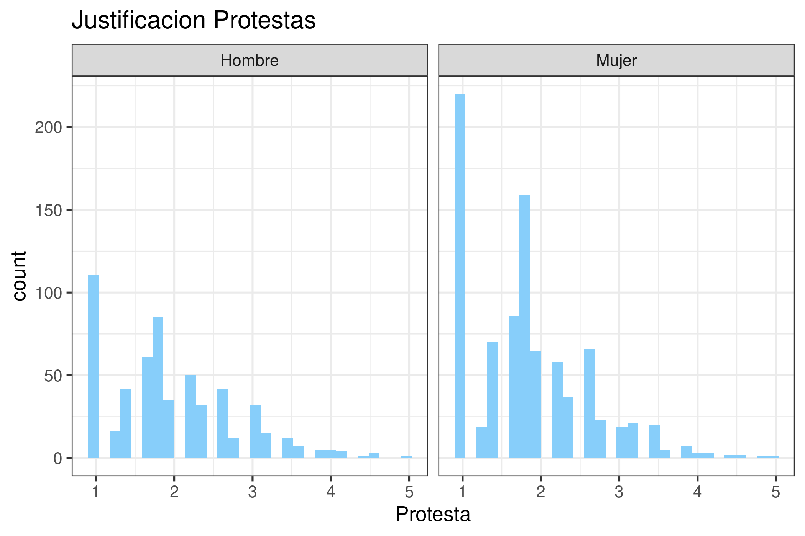

```{r setup, include=FALSE}
knitr::opts_chunk$set(echo = FALSE)
# Esta segunda línea se agrega para indicar que la carpeta desde donde debe partir buscando archivos es la del proyecto R
knitr::opts_knit$set(root.dir = rprojroot::find_rstudio_root_file())
library(dplyr)
```

```{r cargar-datos}
# Con este comando se carga el archivo (lista) que contiene los resultados
resultados <- readRDS("Data/AnalysisData/resultados-reporte.rds")
```

# Introducción

En este ejemplo se muestra como introducir referencias bibliográficas [@dancona_alisis_2002], así como la inclusión de resultados tipo tablas y gráficos [@hair_alisis_1999; @vivanco_analisis_1996]. 

# Tablas de resultados

Con la función `knitr::kable(objeto_a_imprimir)`, podemos imprimir una tabla en formato *R Markdown*.

Para ello hay que tener clara la posición de los resultados en el archivo tipo "lista" que se creó en el tercer código (*3-construccion-resultados.R*).

```{r tabla1}
knitr::kable(resultados[[1]], digits = 2, caption = "Descriptivos protesta")
```

Luego se imprime el resultado 2 creado en el tercer código, y así sucesivamente.
 (*3-construccion-resultados.R*).

```{r tabla2}
knitr::kable(resultados[[2]], digits = 2, caption = "Distribución de género")
```

```{r tabla3}
knitr::kable(resultados[[3]][[2]], digits = 2, caption = "Nivel socioeconómico por género",
             format = "latex", booktabs = T)
```

\newpage

# Gráficos

La lógica para incorporar los gráficos es la misma.
```{r grafico1, message=FALSE, warning=FALSE, fig.align='center', out.width='80%'}
resultados[[4]]
```

También podemos agregar el mismo gráfico, pero directamente desde el archivo de imagen desde el directorio `Output`




\newpage
# Referencias

```{r, echo=FALSE}
rm(list=ls())
```

